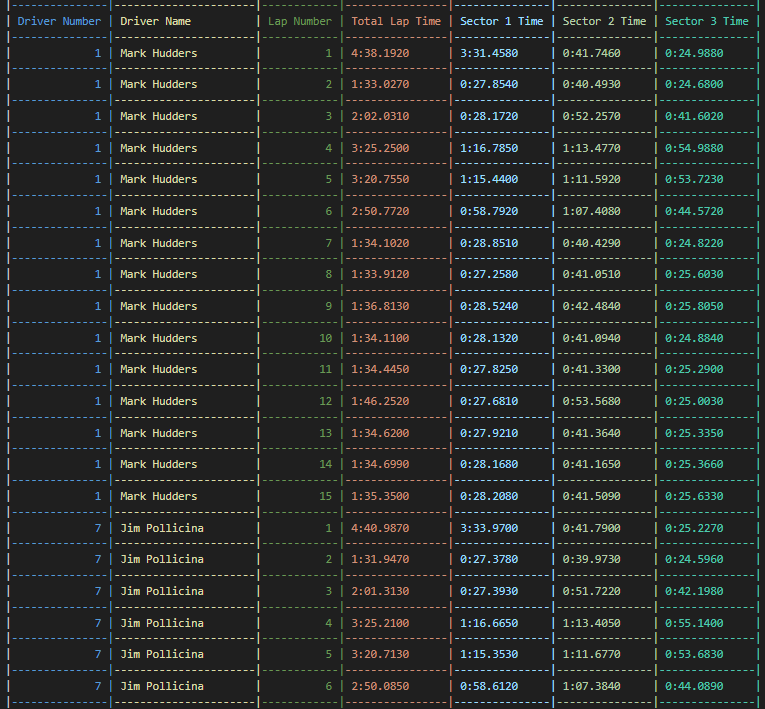
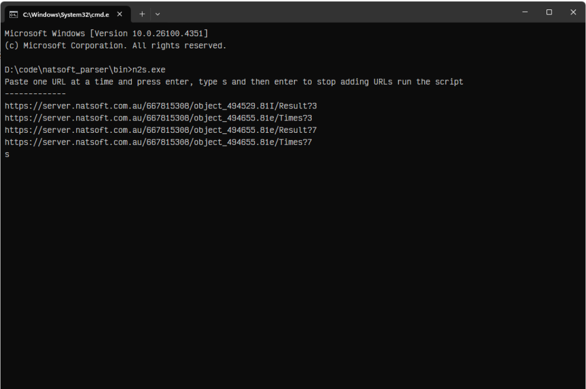
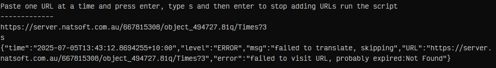

# n2s

Translates the temporary pages generated by [Natsoft](https://server.natsoft.com.au/results/) to csv files

# Download

## Latest Release

The latest release can be downloaded from the releases section of this repo (on the right)

## Build from source

 `git clone https://github.com/Jordation/natsoft_parser.git n2s && cd n2s`

 `go build -ldflags="-s -w" -o bin/n2s.exe .`

# Data ExampLe

## Results

   

## Lap Times

   

# Usage

- Run the exe, you can double click or run it from a terminal
  

- Paste links 1 by 1 and type **s** **s**top entering links and being the conversions
  

# Errors

The links Natsoft generates are temporary and expire anywhere between 1 and 5 minutes, if a link dies it will be reported like so and no output will be generated for it as there is no way to get the page back (you can just re-load it yourself for a fresh link though)
  
